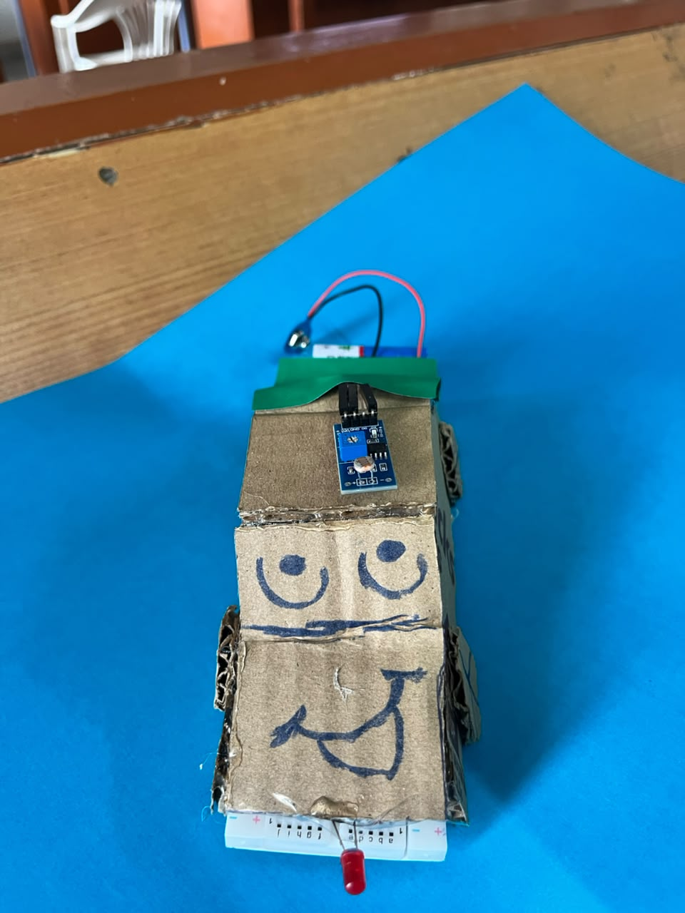
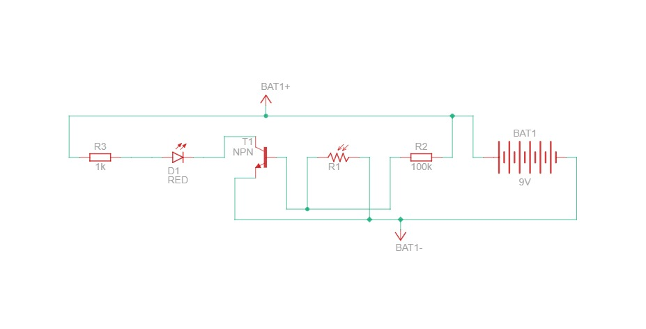

# **Autonomous Environment-Responsive Illumination System**

# **Executive Summary**

The Autonomous Environment-Responsive Illumination System (AERIS) is a hardware prototype engineered to automate vehicle headlight activation in response to sudden changes in ambient light conditions. Human driver perception and reaction times introduce critical delays when entering low-light environments, such as tunnels or abrupt atmospheric storms.

&nbsp;

AERIS eliminates human error by implementing a low-latency, solid-state switching circuit that continuously monitors environmental light intensity using a photo-resistor sensor network. Upon detecting a drop in ambient light below a predetermined threshold, the circuit automatically biases an NPN bipolar junction transistor switch to illuminate the vehicular headlight assembly.

&nbsp;

This document details the problem context, component architecture, electronic switching logic, physical prototype construction, and scalability path toward full automotive integration.

# **Problem Statement**

When operating a motor vehicle at high velocities (e.g., 60km/h or 16.67m/s), entering an unlit tunnel or encountering sudden cloudburst downpours creates an immediate visual acuity deficit. Human perception-reaction time in hazardous driving conditions ranges between 0.5sec to 2.5sec. At 60km/h, a vehicle travels approximately 25km to 41km during this delay before the driver manually identifies the condition, reaches for the headlight control, and toggles the switch.

&nbsp;

During these critical initial seconds, reduced visibility drastically increases the probability of primary and secondary collisions. Manual operation of secondary vehicle controls diverts tactile and cognitive focus away from steering and path tracking. To enhance active vehicle safety, lighting control must be transferred from manual human intervention to a reliable, autonomous hardware control loop that operates with near-zero latency.

# **Hardware Architecture & Components**

The prototype hardware is built using discrete electronic components configured to form an automated sensing and switching logic system.

&nbsp;

* **Light Dependent Resistor (LDR) Module:** Serves as the primary environmental sensor. Its internal cadmium sulfide (CdS) resistance varies inversely with light intensity, forming the primary dynamic element of the voltage divider network.  
* **NPN Bipolar Junction Transistor (e.g., BC547 / 2N3904):** Functions as a solid-state electronic switch. It controls high-side collector current based on small voltage variations applied to its base terminal.  
* **Base Biasing Resistor Network:** A fixed resistor network coupled with the LDR to establish the voltage division ratio, determining the exact base-emitter threshold voltage (V\_BE) required to trigger transistor switching.  
* **Current-Limiting Resistor:** A fixed-value resistor installed in series with the load to restrict forward current (I\_F), protecting the semiconductor junction of the lighting element from thermal overload.  
* **High-Efficiency Light Emitting Diode (LED):** Represents the vehicle's primary headlamp unit, providing visual output when driven into forward conduction.  
* **9V DC Power Supply:** A standard DC power source supplying operational potential across the rail connections.  
* **Prototyping Breadboard & Jumper Interconnects:** Provides a solderless interface for component mounting and electrical node connections.  
* **Custom Vehicular Chassis:** A physical cardboard vehicle body housing the breadboard circuit to demonstrate spatial integration and real-world functional placement.

&nbsp;

| Component | Designator / Specification | Circuit Function |
| :---- | :---- | :---- |
| LDR Sensor Module | Light Dependent Resistor | Environmental light-to-resistance transducer |
| NPN Transistor | General Purpose NPN Switch | Solid-state active load switch |
| Base Resistor | 10 kohm \- 100 kohm | Biasing network sensitivity setter |
| LED Load Resistor | $220 ohm \- 1 kohm | Current limiter for output indicator |
| Output Lamp | High-Brightness LED | Vehicle headlight indicator payload |
| Power Source | 9V DC Battery | Circuit power rail |

# **Working Principle**

The underlying electronic logic relies on the photoelectric characteristics of the LDR integrated within a voltage divider network, coupled to the base bias threshold of an NPN transistor.

## **Phase 1: High Ambient Illumination (Daylight State)**

1. **Low Sensor Resistance:** Photons striking the LDR surface generate electron-hole pairs, reducing its internal resistance .  
2. **Voltage Division:** The LDR forms the upper or lower arm of a potential divider. In high ambient light, the resulting node voltage at the transistor base remains significantly below the turn-on threshold voltage (V\_BE \< 0.7V).  
3. **Transistor Cutoff Region:** With V\_BE \< 0.7 V, base current I\_B approx 0\. The NPN transistor remains in the **Cutoff State**, acting as an open switch.  
4. **Load State:** No current flows from collector to emitter (I\_C \= 0). The LED remains off.

## **Phase 2: Transition to Low Ambient Illumination (Darkness / Tunnel Entry)**

1. **Increased Sensor Resistance:** As ambient light diminishes, photon excitation drops, causing R\_LDR to increase rapidly into the high-kilohm or megohm range.  
2. **Threshold Shift:** The impedance change alters the ratio of the potential divider, causing the voltage at the base node to rise above the 0.7V barrier.  
3. **Transistor Saturation Region:** Base current I\_B begins to flow, driving the transistor from cutoff into the **Saturation State**. The collector-emitter junction conducts fully, exhibiting minimal saturation resistance .  
4. **Load Activation:** Collector current I\_C flows freely from the \+9V rail through the current-limiting resistor, energizing the LED headlamp instantly.

# **Prototype Implementation**

The physical prototype integrates electrical control logic into a functional mechanical model:

&nbsp;

* **Breadboard Circuit Assembly:** All discrete components—LDR sensor module, NPN switching transistor, fixed resistors, and LED headlamp—are arranged on a central breadboard. Component leads are arranged to minimize parasitic impedance and physical cross-talk.  
* **Vehicular Chassis Mounting:** The assembled breadboard is integrated onto a custom-built cardboard vehicle body. The LDR is positioned externally on the vehicle roof to ensure unobstructed ambient light sampling.  
* **Headlamp Integration:** The output LED is aligned at the front fascia of the cardboard chassis, mimicking standard automotive headlamp placement and demonstrating directional illumination forward of the vehicle.

&nbsp;

# **Prototype**

# **Circuits**

# **Future Scope & Scalability**

While the current discrete analog prototype demonstrates core switching logic, automotive field deployment requires scaling to digital control networks and high-power actuators:

&nbsp;

* **Microcontroller Integration:** Replacing or augmenting the analog biasing network with a microcontroller (e.g., ATmega328P / STM32 / Raspberry Pi Pico) enables digital Signal Processing (DSP). This allows implementation of hysteresis algorithms and software debouncing to prevent high-frequency flickering caused by transient shadows or streetlamps.  
* **Pulse-Width Modulation (PWM) & Adaptive Dimming:** Microcontroller PWM outputs allow progressive brightness scaling (daytime running lights vs. full high-beam headlight output) dependent on ambient lux metrics.  
* **High-Power Automotive Switching:** Integrating solid-state relays (SSRs) or Automotive Power MOSFETs (e.g., N-channel TrenchFETs) allows the low-current logic stage to safely switch high-current (10A \- 30A) automotive halogen or high-density LED arrays.  
* **CAN Bus & Multi-Sensor Fusion:** Interfacing the light sensor system with the vehicle's Controller Area Network (CAN Bus) allows cross-referencing with vehicle speed, rain sensors (for automatic wiper-headlight coupling), and steering angle sensors for dynamic adaptive cornering headlights.

&nbsp;
